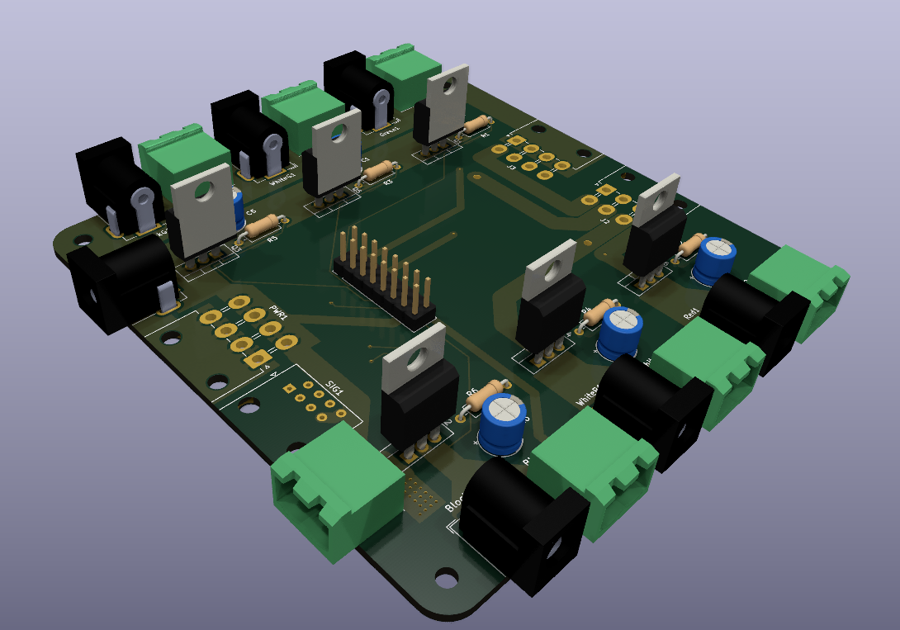

# SG12_ScoringExtensionLights
A module for the [SG12 fencing scoring machine](https://www.blue-gauntlet.com/SG12-ST-MACHINE-w-score-and-time-and-remote_p_3799.html) that allows for 12V LED strips to be used as extension lights.

You can view the mirror on [CADLAB.io](https://cadlab.io/project/27194/main/files) if you want to see the schematic. < Needs to be updated, not sure why mirroring is not working.

# Get PCBs
**Disclaimer: If ordering through their site, PCBWay will "donate 10% PCB and PCB assembly cost to" [me](https://github.com/QuantumEF)**

